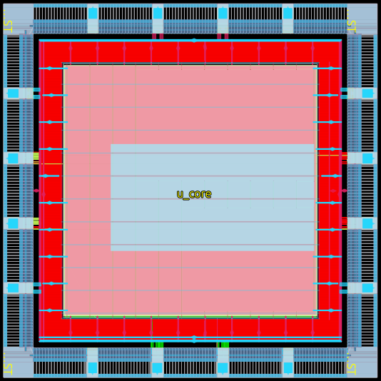

# Acelerador CNN LeNet-5 sobre sky130A — TFM

Repositorio público asociado al Trabajo Fin de Máster.

> **Título.** Validación del flujo de diseño de circuitos integrados digitales con herramientas de código abierto en los entornos eFabless y IEEE-SSCS PICO
>
> **Autor.** Carlos Saccogna
>
> **Tutores.** Ricardo Carmona Galán · José Manuel de la Rosa Utrera
>
> **Universidad.** Universidad de Sevilla
>
> **Máster Universitario en Microelectrónica.** Diseño y Aplicaciones de Sistemas Micro/Nanométricos
>
> **Fecha.** Mayo de 2026
>
> **Memoria.** [`docs/tfm.pdf`](docs/tfm.pdf)

El proyecto recorre el flujo completo **RTL-to-GDSII** sobre el PDK abierto **SkyWater sky130A** utilizando exclusivamente herramientas libres orquestadas por **LibreLane v3.0.0**. El caso de estudio es un acelerador hardware para clasificación de dígitos MNIST que implementa una variante cuantizada de la red **LeNet-5** (INT8).

<p align="center">
  
  <br>
  <em>Layout final del chip integrado (run <code>spi-chip-hier-28</code>): núcleo SPI endurecido en el centro, anillo de pads sky130 y conexiones PDN core-padring.</em>
</p>

## Resumen del diseño

| Parámetro | Valor |
|---|---|
| Tecnología | SkyWater sky130A (130 nm) |
| Reloj | 15 MHz (66.67 ns) |
| Interfaz host | OBI v1.0 (32 bits) o SPI (selección en tiempo de compilación) |
| Aritmética | INT8 cuantizada, acumuladores 32 bits |
| MACs paralelos | 4 (modos OC-parallel e IC-parallel) |
| SRAM interna | 12 KB (8 KB parámetros + 4 KB activaciones, OpenRAM) |
| Latencia inferencia | ~470 k ciclos (~31 ms @ 15 MHz) |
| Núcleo endurecido | 1700 × 1700 µm |
| Chip con padring | 2500 × 2500 µm |

**Pipeline de inferencia:**

```
Input 28×28×1 (UINT8)
  → Conv1 (3×3, 1→8)   + ReLU + MaxPool 2×2  → 13×13×8
  → Conv2 (3×3, 8→16)  + ReLU + MaxPool 2×2  → 5×5×16
  → Conv3 (3×3, 16→32) + ReLU                → 3×3×32
  → GAP (3×3 → 1)                            → 32
  → FC (32→10)                               → 10 logits
  → ArgMax                                   → clase (0-9)
```

## Estructura del repositorio

```
rtl/
  modules/        RTL sintetizable (.v) y testbenches (tb_*.sv) + constantes.vh
  macros/         Colateral OpenRAM de las SRAM (.v, .lib, .lef, .gds, .sp)
  sim/            Scripts de simulación (RTL, GLS post-synth, GLS post-PnR, SDF)
python/           Entrenamiento, cuantización PTQ INT8, golden model, empaquetado de hex
datos_hex_std/    Salida del flujo Python (regenerable, no se versiona)
docs/             Datasheet del acelerador, documentos técnicos e imágenes
librelane_flow/
  cnn_top/        Configs JSON, SDC multi-corner y Tcl custom (PDN, padring)
  shift-reg/      Flujo de prueba (shift register de 8 bits) para validar el toolchain
requirements.txt  Dependencias Python del flujo offline
Makefile          Targets de regresión RTL/GLS y flujo físico
```

### Runs físicos canónicos del TFM

| Run | Variante | Descripción |
|---|---|---|
| `spi-hardened-5` | core SPI | Cierre físico del núcleo con interfaz SPI (deliverable del chip) |
| `obi-hardened-2` | core OBI | Cierre físico del núcleo con interfaz OBI (entregable SoC-ready) |
| `spi-chip-hier-28` | chip integrado | Núcleo SPI endurecido + padring custom, flujo jerárquico |

Los `runs/` no se versionan por tamaño pero son reproducibles bit a bit con los targets `make librelane-*` (ver más abajo).

## Reproducción del flujo

### Prerrequisitos

- Linux x86_64 con Python 3.10+, Make, Git e Icarus Verilog instalados.
- **Nix** para entrar al `nix-shell` de LibreLane.
- **LibreLane v3.0.0** clonado en local (`git clone --branch 3.0.0 https://github.com/librelane/librelane.git`).
- **sky130A** instalado bajo `~/.ciel/sky130A` (lo provisiona LibreLane la primera vez que se entra a su nix-shell).
- Variable `PDK_ROOT` apuntando al directorio que contiene `sky130A/` (por defecto `~/.ciel`).

### Pasos

```bash
# 1. Clonar el repositorio
git clone https://github.com/carsacc/cnn-lenet5-sky130-librelane.git
cd cnn-lenet5-sky130-librelane

# 2. Verificar dependencias del flujo de simulación
make check-env

# 3. Entorno Python
python3 -m venv .venv
source .venv/bin/activate
pip install -r requirements.txt

# 4. Flujo Python (entrenamiento + cuantización + hex de parámetros y golden)
make train
make gen-hex

# 5. Regresión RTL completa (unitarios + top-level OBI/SPI)
make sim-all

# 6. Entrar al ambiente Nix para LibreLane y los GLS
nix-shell ~/ASIC/tools/librelane

# 7. Cierre físico del core SPI (deliverable del chip)
make librelane-spi-hardened-5
# equivalente: librelane librelane_flow/cnn_top/config_core_spi.json \
#                        --run-tag spi-hardened-5

# 8. Cierre físico opcional del core OBI
make librelane-obi-hardened-2

# 9. GLS funcional sobre el run anterior (TB SPI por defecto)
make gls-postsynth RUN=spi-hardened-5             # post-síntesis
make gls-postpnr   RUN=spi-hardened-5             # post-PnR
make gls-sdf       RUN=spi-hardened-5 CORNER=tt   # post-PnR + SDF

# 10. Cierre físico del chip integrado con padring
make librelane-spi-chip-hier-28
# equivalente: librelane librelane_flow/cnn_top/config_chip_hier.json \
#                        --run-tag spi-chip-hier-28
```

El `--run-tag` de los pasos 7 y 10 es obligatorio: `config_chip_hier.json` referencia explícitamente los artefactos en `runs/spi-hardened-5/final/...`, por lo que el chip-hier sólo se cierra si el core SPI se endureció con ese tag exacto. Los targets `make librelane-*` encapsulan los tags canónicos.

La regeneración de las macros SRAM con OpenRAM y Xyce no es necesaria para reproducir el flujo. El repositorio incluye las vistas firmadas (`.lib`, `.lef`, `.gds`, `.sp`); la caracterización completa tarda varios días en un servidor de cálculo.

### Targets del Makefile

| Target | Descripción |
|---|---|
| `make check-env` | Comprueba herramientas, PDK y SRAM macros |
| `make sim-unit` | Lanza los testbenches unitarios |
| `make sim-obi` | Top-level RTL via OBI (`NUM_IMAGES=3` por defecto) |
| `make sim-spi` | Top-level RTL via SPI |
| `make sim-all` | Regresión RTL completa (unitarios + top-level) |
| `make gls-postsynth RUN=<run>` | GLS post-síntesis con testbench SPI |
| `make gls-postsynth-obi RUN=<run>` | Variante OBI del GLS post-síntesis |
| `make gls-postpnr RUN=<run>` | GLS post-PnR funcional con testbench SPI |
| `make gls-postpnr-obi RUN=<run>` | Variante OBI del GLS post-PnR |
| `make gls-sdf RUN=<run> CORNER=tt` | GLS post-PnR con anotación SDF (CVC64) |
| `make librelane-spi-hardened-5` | Endurece el core SPI (run-tag `spi-hardened-5`) |
| `make librelane-obi-hardened-2` | Endurece el core OBI (run-tag `obi-hardened-2`) |
| `make librelane-spi-chip-hier-28` | Endurece el chip integrado (depende del core SPI) |
| `make librelane-shift-reg` | Flujo de prueba (shift register 8 bits) |
| `make train` | Entrenamiento + cuantización + export hex + golden |
| `make gen-hex` | Empaqueta los hex de parámetros en `PARAM_MEM_32x2048.hex` |

## Mapa de memoria (interfaz OBI/SPI)

| Región | Dirección | Tamaño | Contenido |
|---|---|---|---|
| Param Memory | `0x0000`–`0x1FFF` | 8 KB | Pesos, biases, parámetros de re-cuantización |
| Activation Buf A | `0x2000`–`0x3FFF` | 2 KB | Mapas de activación (palabras 0–511) |
| Activation Buf B | `0x4000`–`0x5FFF` | 2 KB | Mapas de activación (palabras 512–1023) |
| CSR | `0x6000`–`0x600F` | 4 reg | CTRL, STATUS, RESULT, reservado |

**Protocolo de uso:**

1. Escribir parámetros del modelo en Param Memory (una sola vez).
2. Escribir imagen MNIST en Activation Buffer A (4 píxeles por palabra para Conv1).
3. Escribir `1` en CTRL para arrancar la inferencia.
4. Sondear STATUS hasta que el bit `done` se ponga a 1.
5. Leer RESULT (bits [3:0]) para obtener la clase predicha.
6. Escribir `0` en CTRL para liberar las memorias.

## Documentación adicional

- [`docs/tfm.pdf`](docs/tfm.pdf) — Memoria completa del TFM (PDF).
- [`docs/CNN_ACCELERATOR_DATASHEET.md`](docs/CNN_ACCELERATOR_DATASHEET.md) — Datasheet interno del acelerador (módulos, mapas de memoria, timing, cuantización).
- [`docs/PARAM_MEM_DETAILED_MAP.txt`](docs/PARAM_MEM_DETAILED_MAP.txt) — Mapa detallado de la Param Memory.
- [`docs/TB_CNN_TOP_FULL_GUIDE.md`](docs/TB_CNN_TOP_FULL_GUIDE.md) — Guía del testbench top-level.

